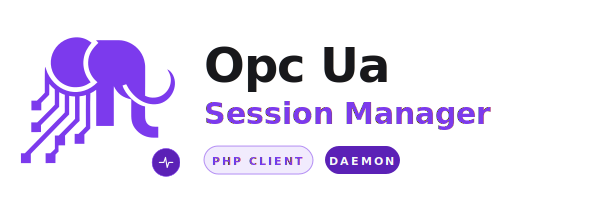

<h1 align="center"><strong>OPC UA PHP Client Session Manager</strong></h1>

<div align="center">
  <picture>
    <source media="(prefers-color-scheme: dark)" srcset="assets/logo-dark.svg">
    <source media="(prefers-color-scheme: light)" srcset="assets/logo-light.svg">
    
  </picture>
</div>

<p align="center">
  <a href="https://github.com/GianfriAur/opcua-php-client-session-manager/actions/workflows/tests.yml"></a>
  <a href="https://codecov.io/gh/GianfriAur/opcua-php-client-session-manager"></a>
  <a href="https://packagist.org/packages/gianfriaur/opcua-php-client-session-manager"></a>
  <a href="https://packagist.org/packages/gianfriaur/opcua-php-client-session-manager"></a>
  <a href="LICENSE"></a>
</p>

---

Keep OPC UA sessions alive across PHP requests. A daemon-based session manager for [`opcua-php-client`](https://github.com/GianfriAur/opcua-php-client) that eliminates the 50–200ms connection handshake overhead on every HTTP request.

PHP's request/response model destroys all state — including network connections — at the end of every request. OPC UA requires a 5-step handshake (TCP → Hello/Ack → OpenSecureChannel → CreateSession → ActivateSession) that must be repeated every single time. This package solves the problem with a long-running [ReactPHP](https://reactphp.org/) daemon that holds sessions in memory, communicating with PHP applications via a lightweight Unix socket IPC protocol.

**What you get:**

- **Session persistence** — OPC UA connections survive across HTTP requests. Pay the handshake cost once, reuse forever
- **Drop-in replacement** — `ManagedClient` implements the same `OpcUaClientInterface` as the direct `Client`. Swap one line, keep all your code
- **All OPC UA operations** — browse, read, write, method calls, subscriptions, history, path resolution, type discovery
- **Security hardening** — method whitelist, IPC authentication, credential stripping, error sanitization, connection limits
- **Automatic cleanup** — expired sessions are disconnected after configurable inactivity timeout
- **Graceful shutdown** — SIGTERM/SIGINT cleanly disconnect all active sessions

> **A note on versioning:** We're aware of the rapid major releases in a short time frame. This library is under active, full-time development right now — the goal is to reach a production-stable state as quickly as possible. Breaking changes are being bundled and shipped deliberately to avoid dragging them out across many minor releases. Once the API surface settles, major version bumps will become rare. Thanks for your patience.

## Quick Start

```bash
composer require gianfriaur/opcua-php-client-session-manager
```

### 1. Start the daemon

```bash
php bin/opcua-session-manager
```

### 2. Use ManagedClient in your PHP code

```php
use Gianfriaur\OpcuaSessionManager\Client\ManagedClient;

$client = new ManagedClient();
$client->connect('opc.tcp://localhost:4840');

$value = $client->read('i=2259');
echo $value->getValue(); // 0 = Running

$client->disconnect();
```

That's it. Same API as the direct `Client`, but the session stays alive between requests.

## See It in Action

### Session persistence across requests

```php
// Request 1: open session — handshake happens once
$client = new ManagedClient();
$client->connect('opc.tcp://localhost:4840');
$_SESSION['opcua'] = $client->getSessionId();
// Do NOT call disconnect() — session stays alive in daemon

// Request 2: reuse the same session — no handshake needed
$client = new ManagedClient();
$client->connect('opc.tcp://localhost:4840');
$value = $client->read('i=2259'); // ~5ms instead of ~155ms
```

### Browse and read

```php
$refs = $client->browse('i=85');
foreach ($refs as $ref) {
    echo "{$ref->displayName} ({$ref->nodeId})\n";
}

$nodeId = $client->resolveNodeId('/Objects/Server/ServerStatus');
$status = $client->read($nodeId);
```

### Read multiple values with fluent builder

```php
$results = $client->readMulti()
    ->node('i=2259')->value()
    ->node('ns=2;i=1001')->displayName()
    ->execute();
```

### Write to a PLC

```php
use Gianfriaur\OpcuaPhpClient\Types\BuiltinType;

$client->write('ns=2;i=1001', 42, BuiltinType::Int32);
```

### Subscribe to data changes

```php
$sub = $client->createSubscription(publishingInterval: 500.0);

$client->createMonitoredItems($sub->subscriptionId, [
    ['nodeId' => 'ns=2;i=1001'],
]);

$response = $client->publish();
foreach ($response->notifications as $notif) {
    echo $notif['dataValue']->getValue() . "\n";
}
```

### Secure connection with authentication

```php
use Gianfriaur\OpcuaPhpClient\Security\SecurityPolicy;
use Gianfriaur\OpcuaPhpClient\Security\SecurityMode;

$client = new ManagedClient(
    socketPath: '/var/run/opcua-session-manager.sock',
    authToken: trim(file_get_contents('/etc/opcua/daemon.token')),
);

$client->setSecurityPolicy(SecurityPolicy::Basic256Sha256);
$client->setSecurityMode(SecurityMode::SignAndEncrypt);
$client->setClientCertificate('/certs/client.pem', '/certs/client.key');
$client->setUserCredentials('operator', 'secret');
$client->connect('opc.tcp://192.168.1.100:4840');
```

> **Tip:** Skip `setClientCertificate()` and a self-signed cert gets auto-generated in memory — perfect for quick tests or servers with auto-accept.

## How It Works

```
┌──────────────┐         ┌──────────────────────────────┐         ┌──────────────┐
│  PHP Request │ ──IPC──►│  Session Manager Daemon      │ ──TCP──►│  OPC UA      │
│  (short-     │◄──IPC── │                              │◄──TCP── │  Server      │
│   lived)     │         │  ● ReactPHP event loop       │         │              │
└──────────────┘         │  ● Sessions in memory        │         └──────────────┘
                         │  ● Periodic cleanup timer    │
┌──────────────┐         │  ● Signal handlers           │
│  PHP Request │ ──IPC──►│                              │
│  (reuses     │◄──IPC── │  Sessions:                   │
│   session)   │         │   [sess-a1b2] → Client (TCP) │
└──────────────┘         │   [sess-c3d4] → Client (TCP) │
                         └──────────────────────────────┘
```

Without the session manager:
```
Request 1:  [connect 150ms] [read 5ms] [disconnect]  → total ~155ms
Request 2:  [connect 150ms] [read 5ms] [disconnect]  → total ~155ms
```

With the session manager:
```
Request 1:  [open session 150ms] [read 5ms]           → total ~155ms  (first time only)
Request 2:                       [read 5ms]           → total ~5ms
Request N:                       [read 5ms]           → total ~5ms
```

## Features

| Feature | What it does |
|---|---|
| **Drop-in Replacement** | `ManagedClient` implements the same `OpcUaClientInterface` as the direct `Client` |
| **Session Persistence** | OPC UA sessions survive across PHP requests via the daemon |
| **All OPC UA Operations** | Browse, read, write, method calls, subscriptions, history, path resolution |
| **String NodeIds** | All methods accept `'i=2259'` or `'ns=2;s=MyNode'` in addition to `NodeId` objects |
| **Fluent Builder API** | `readMulti()`, `writeMulti()`, `createMonitoredItems()`, `translateBrowsePaths()` support chainable builders |
| **Typed Returns** | All service responses return `public readonly` DTOs — `SubscriptionResult`, `CallResult`, `BrowseResultSet`, etc. |
| **Type Discovery** | `discoverDataTypes()` auto-detects custom server structures |
| **Transfer & Recovery** | `transferSubscriptions()` and `republish()` for session migration |
| **PSR-3 Logging** | Optional structured logging via any PSR-3 logger |
| **PSR-16 Cache** | Cache management forwarded to daemon — `invalidateCache()`, `flushCache()` |
| **Security** | 6 policies, 3 auth modes, IPC authentication, method whitelist |
| **Auto-Retry** | Automatic reconnect on connection failures |
| **Auto-Batching** | Transparent batching for `readMulti()`/`writeMulti()` |
| **Automatic Cleanup** | Expired sessions closed after inactivity timeout |
| **Graceful Shutdown** | SIGTERM/SIGINT disconnect all sessions cleanly |

## Daemon Options

```bash
php bin/opcua-session-manager [options]
```

| Option | Default | Description |
|--------|---------|-------------|
| `--socket <path>` | `/tmp/opcua-session-manager.sock` | Unix socket path |
| `--timeout <sec>` | `600` | Session inactivity timeout |
| `--cleanup-interval <sec>` | `30` | Expired session cleanup interval |
| `--auth-token <token>` | *(none)* | Shared secret for IPC authentication |
| `--auth-token-file <path>` | *(none)* | Read auth token from file (recommended) |
| `--max-sessions <n>` | `100` | Maximum concurrent sessions |
| `--socket-mode <octal>` | `0600` | Socket file permissions |
| `--allowed-cert-dirs <dirs>` | *(none)* | Comma-separated allowed certificate directories |

Auth token priority: `OPCUA_AUTH_TOKEN` env var > `--auth-token-file` > `--auth-token`.

## Security

The daemon implements multiple layers of security hardening:

- **IPC authentication** — shared-secret token validated with timing-safe `hash_equals()`
- **Socket permissions** — `0600` by default (owner-only)
- **Method whitelist** — only 37 documented OPC UA operations allowed via `query`
- **Credential protection** — passwords and private key paths stripped immediately after connection
- **Session limits** — configurable maximum to prevent resource exhaustion
- **Certificate path restrictions** — `--allowed-cert-dirs` constrains certificate directories
- **Input size limit** — IPC requests capped at 1MB
- **Connection protection** — 30s per-connection timeout, max 50 concurrent IPC connections
- **Error sanitization** — messages truncated, file paths stripped
- **PID file lock** — prevents multiple daemon instances

### Recommended production setup

```bash
openssl rand -hex 32 > /etc/opcua/daemon.token
chmod 600 /etc/opcua/daemon.token

OPCUA_AUTH_TOKEN=$(cat /etc/opcua/daemon.token) php bin/opcua-session-manager \
    --socket /var/run/opcua-session-manager.sock \
    --socket-mode 0660 \
    --max-sessions 50 \
    --allowed-cert-dirs /etc/opcua/certs
```

## Comparison

| | Direct `Client` | `ManagedClient` |
|-|-----------------|-----------------|
| Connection | Direct TCP | Via daemon (Unix socket) |
| Session lifetime | Dies with PHP process | Persists across requests |
| Per-operation overhead | ~1–5ms | ~5–15ms |
| Connection overhead | ~50–200ms every request | ~50–200ms first time only |
| Subscriptions | Lost between requests | Maintained by daemon |
| Certificate paths | Relative or absolute | Absolute only |

## Documentation

| # | Document | Covers |
|---|----------|--------|
| 01 | [Introduction](doc/01-introduction.md) | Overview, requirements, quick start |
| 02 | [Overview & Architecture](doc/02-overview.md) | Problem, solution, components |
| 03 | [Installation](doc/03-installation.md) | Requirements, Composer setup, project structure |
| 04 | [Daemon](doc/04-daemon.md) | CLI options, security, systemd/Supervisor, internals |
| 05 | [ManagedClient API](doc/05-managed-client.md) | Full API reference, configuration, session persistence |
| 06 | [IPC Protocol](doc/06-ipc-protocol.md) | Transport, commands, authentication, wire format |
| 07 | [Type Serialization](doc/07-type-serialization.md) | JSON conversion for all OPC UA types and DTOs |
| 08 | [Testing](doc/08-testing.md) | Test infrastructure, helper class, running tests |
| 09 | [Examples](doc/09-examples.md) | Complete code examples for all features |

## Testing

```bash
./vendor/bin/pest                                          # everything
./vendor/bin/pest tests/Unit/                              # unit only
./vendor/bin/pest tests/Integration/ --group=integration   # integration only
```

340+ tests (unit + integration) covering browse, read/write, subscriptions, method calls, path resolution, connection state, security, type serialization, session persistence, session recovery, and all v3.0.0 DTOs.

> **Note on coverage:** `SessionManagerDaemon` is excluded from coverage reports because it runs as a separate long-lived process (ReactPHP event loop). PHP coverage tools (pcov, xdebug) only instrument the test runner process — they cannot track code executing inside a subprocess started via `proc_open()`. The daemon is fully tested by the integration suite, which starts a real daemon, sends IPC commands, and verifies responses. This is a known limitation shared by other daemon-based PHP packages (Laravel Horizon, Symfony Messenger, RoadRunner workers).

## Ecosystem

| Package | Description |
|---------|-------------|
| [opcua-php-client](https://github.com/GianfriAur/opcua-php-client) | Pure PHP OPC UA client — the core protocol implementation |
| [opcua-php-client-session-manager](https://github.com/GianfriAur/opcua-php-client-session-manager) | Session persistence daemon (this package) |
| [opcua-laravel-client](https://github.com/GianfriAur/opcua-laravel-client) | Laravel integration — service provider, facade, config |
| [opcua-test-server-suite](https://github.com/GianfriAur/opcua-test-server-suite) | Docker-based OPC UA test servers for integration testing |

## Roadmap

See [ROADMAP.md](ROADMAP.md) for what's coming next.

## Contributing

Contributions welcome — see [CONTRIBUTING.md](CONTRIBUTING.md).

## Changelog

See [CHANGELOG.md](CHANGELOG.md).

## License

[MIT](LICENSE)
